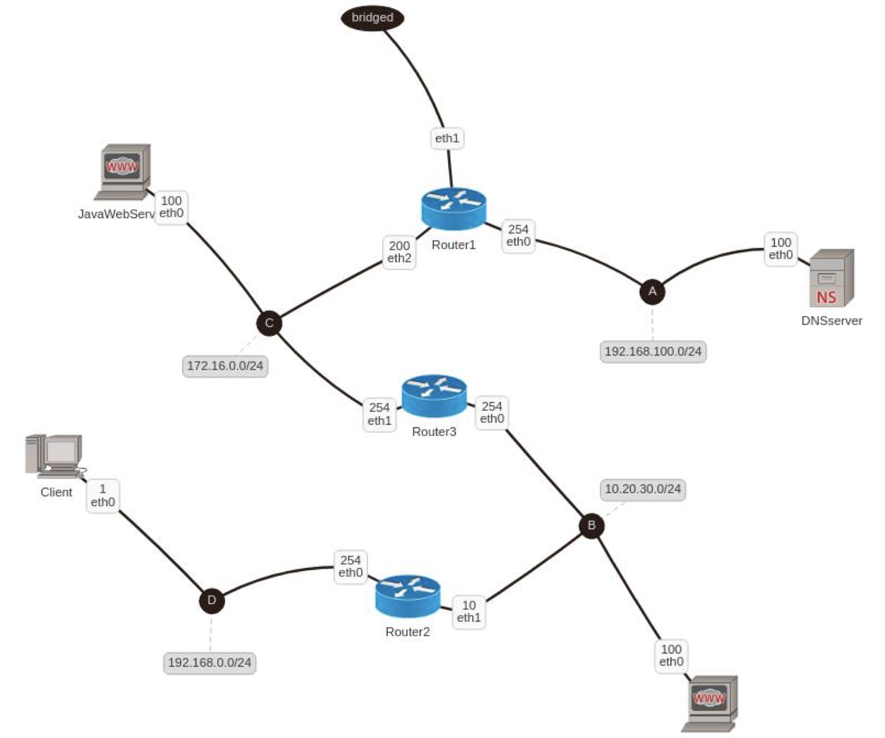
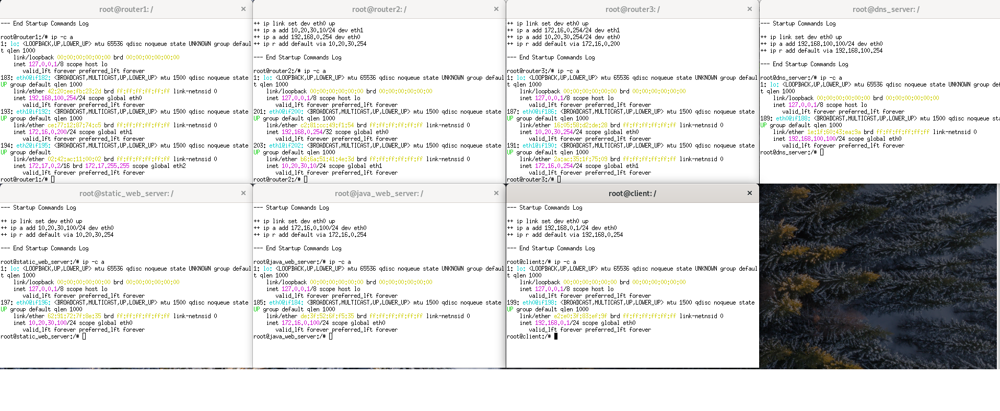
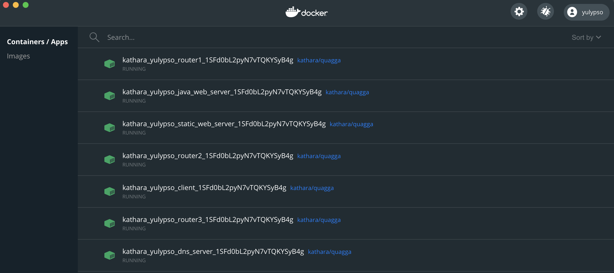
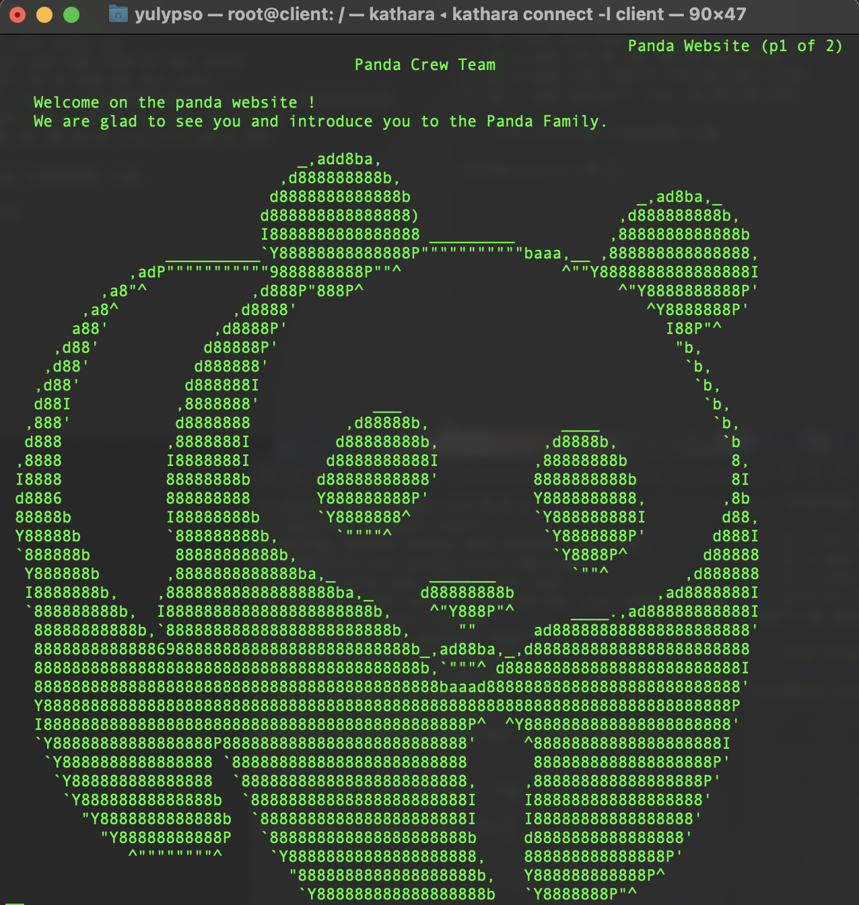

# Kathara Panda

## Authors

[Raphaël Dray](https://www.linkedin.com/in/raphaeldray/) <br>
[Clara Nacache](https://www.linkedin.com/in/claranacache/) <br>
[Thierry Khamphousone](https://www.linkedin.com/in/tkhamphousone/) <br>

<br>

## Introduction 

[Kathara](https://www.kathara.org) is a network emulation system based on Docker where each device is emulated by an unique container which is interconnected by virtual L2 LANs, and each container can run a Docker image. Kathara is helpful to develop new network protocols within a testing network sandbox environment. It is a NetKit implementation.

<p align="center" width="100%">
    
</p>


<br>

__Domain names__

- **DNS name**: panda-crew.com 
- **SOA**: giga.panda-crew.com (192.168.100.100)
- **Static Web Server name**: sws.panda-crew.com (10.20.30.100)
- **Java Web Server name**: jws.panda-crew.com (172.16.0.100)
- **Alias on Java Web Server**: www.panda-crew.com (172.16.0.100)


<hr><br>

## How does it work?

### Run Kathara's clusters

__Requirements:__
- [Kathara installation](https://github.com/KatharaFramework/Kathara/wiki)
- [Docker installation](https://www.docker.com/get-started)
<br>

__Important:__ 

Kathara needs Docker to be running to start computers. So you must run Docker before Kathara lab.

```bash
#Start the project by looking at the lab.conf definitions
> kathara lstart

#Stop all computers started from the lab.conf file
> kathara wipe
```

## Project description 

### Network Schema

<p align="center" width="100%">
    
</p>

<br>

### Network Configuration

<p align="center" width="100%">
    
</p>

<br>


### Configuration explanations
- [__router1__](https://github.com/MrrRaph/Kathara-Panda/blob/master/router1.startup): Communication between subnet A and subnet C
- [__router2__](https://github.com/MrrRaph/Kathara-Panda/blob/master/router2.startup): Communication between subnet D and subnet B
- [__router3__](https://github.com/MrrRaph/Kathara-Panda/blob/master/router3.startup): Communication between subnet C and subnet B
- [__Client__](https://github.com/MrrRaph/Kathara-Panda/blob/master/client.startup): Get the HTML from the Java Web Server through Domain name
- [__DNS Server__](https://github.com/MrrRaph/Kathara-Panda/blob/master/dns_server.startup): Define domain names and aliases
- [__Java Web Server__](https://github.com/MrrRaph/Kathara-Panda/blob/master/java_web_server.startup): Uses as a Proxy for getting the HTML from the Static Web Server
- [__Static Web Server__](https://github.com/MrrRaph/Kathara-Panda/blob/master/static_web_server.startup): Serves HTML pages

<br>

#### Devices emulated by Docker containers

<p align="center" width="100%">
    
</p>

<hr> <br>

## Lab testing

```bash
> traceroute www.panda-crew.com     
traceroute to www.panda-crew.com (172.16.0.100), 30 hops max, 60 byte packets
 1  192.168.0.254 (192.168.0.254)  0.105 ms  0.027 ms  0.014 ms
 2  10.20.30.254 (10.20.30.254)  0.036 ms  0.026 ms  0.026 ms
 3  jws.panda-crew.com (172.16.0.100)  0.051 ms  0.040 ms  0.040 ms

> links http://www.panda-crew.com:1111
```
<br>
<p align="center" width="100%">
    
</p>

<br>

### DNS server configuration checking

```bash
#panda-crew.com
> dig panda-crew.com

; <<>> DiG 9.10.3-P4-Debian <<>> panda-crew.com
;; global options: +cmd
;; Got answer:
;; ->>HEADER<<- opcode: QUERY, status: NOERROR, id: 17539
;; flags: qr aa rd ra; QUERY: 1, ANSWER: 0, AUTHORITY: 1, ADDITIONAL: 1

;; OPT PSEUDOSECTION:
; EDNS: version: 0, flags:; udp: 4096
;; QUESTION SECTION:
;panda-crew.com.			IN	A

;; AUTHORITY SECTION:
panda-crew.com.		604800	IN	SOA	giga.panda-crew.com. admin.panda-crew.com. 3 604800 86400 2419200 604800

;; Query time: 0 msec
;; SERVER: 192.168.100.100#53(192.168.100.100)
;; WHEN: Mon Jan 04 21:09:16 UTC 2021
;; MSG SIZE  rcvd: 90


#java web server
> dig jws.panda-crew.com

; <<>> DiG 9.10.3-P4-Debian <<>> jws.panda-crew.com
;; global options: +cmd
;; Got answer:
;; ->>HEADER<<- opcode: QUERY, status: NOERROR, id: 55204
;; flags: qr aa rd ra; QUERY: 1, ANSWER: 1, AUTHORITY: 1, ADDITIONAL: 2

;; OPT PSEUDOSECTION:
; EDNS: version: 0, flags:; udp: 4096
;; QUESTION SECTION:
;jws.panda-crew.com.		IN	A

;; ANSWER SECTION:
jws.panda-crew.com.	604800	IN	A	172.16.0.100

;; AUTHORITY SECTION:
panda-crew.com.		604800	IN	NS	giga.panda-crew.com.

;; ADDITIONAL SECTION:
giga.panda-crew.com.	604800	IN	A	192.168.100.100

;; Query time: 0 msec
;; SERVER: 192.168.100.100#53(192.168.100.100)
;; WHEN: Mon Jan 04 21:09:39 UTC 2021
;; MSG SIZE  rcvd: 98


#static web server
> dig sws.panda-crew.com

; <<>> DiG 9.10.3-P4-Debian <<>> sws.panda-crew.com
;; global options: +cmd
;; Got answer:
;; ->>HEADER<<- opcode: QUERY, status: NOERROR, id: 7321
;; flags: qr aa rd ra; QUERY: 1, ANSWER: 1, AUTHORITY: 1, ADDITIONAL: 2

;; OPT PSEUDOSECTION:
; EDNS: version: 0, flags:; udp: 4096
;; QUESTION SECTION:
;sws.panda-crew.com.		IN	A

;; ANSWER SECTION:
sws.panda-crew.com.	604800	IN	A	10.20.30.100

;; AUTHORITY SECTION:
panda-crew.com.		604800	IN	NS	giga.panda-crew.com.

;; ADDITIONAL SECTION:
giga.panda-crew.com.	604800	IN	A	192.168.100.100

;; Query time: 0 msec
;; SERVER: 192.168.100.100#53(192.168.100.100)
;; WHEN: Mon Jan 04 21:09:59 UTC 2021
;; MSG SIZE  rcvd: 98
```

<br>

### Apache file retrieving

```bash
> wget sws.panda-crew.com

--2021-01-04 21:12:12--  http://sws.panda-crew.com/
Resolving sws.panda-crew.com (sws.panda-crew.com)... 10.20.30.100
Connecting to sws.panda-crew.com (sws.panda-crew.com)|10.20.30.100|:80... connected.
HTTP request sent, awaiting response... 200 OK
Length: 3482 (3.4K) [text/html]
Saving to: 'index.html'

index.html             100%[==========================>]   3.40K  --.-KB/s    in 0s      

2021-01-04 21:12:12 (396 MB/s) - 'index.html' saved [3482/3482]

```
