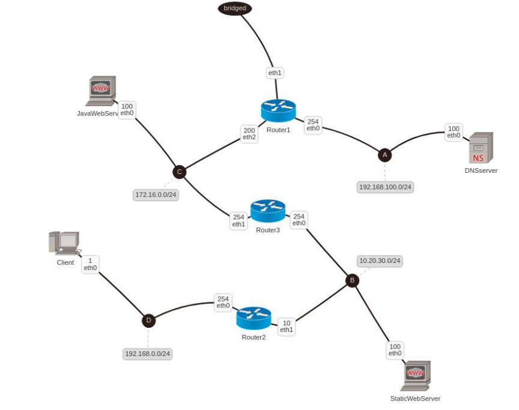

# Kathara Panda

## Authors

[Raphaël Dray](https://www.linkedin.com/in/raphaeldray/) <br>
[Clara Nacache](https://www.linkedin.com/in/claranacache/) <br>
[Thierry Khamphousone](https://www.linkedin.com/in/tkhamphousone/) <br>

<br>

## Introduction 

[Kathara](https://www.kathara.org) is a network emulation system based on Docker where each device is emulated by an unique container which is interconnected by virtual L2 LANs, and each container can run a Docker image. Kathara is helpful to develop new network protocols within a testing network sandbox environment. It is a NetKit implementation.

<p align="center" width="100%">
    
</p>

<hr><br>

## How does it work?

__Run Kathara's clusters__

Requirements: 
- [Kathara installation](https://github.com/KatharaFramework/Kathara/wiki)
- [Docker installation](https://www.docker.com/get-started)
<br>

Important: Run Docker before Kathara

```bash
#Start the project by looking at the lab.conf definitions
> kathara lstart

#Stop all computers started from the lab.conf file
> kathara wipe
```

## Project description 

__Network Schema__

<p align="center" width="100%">
    
</p>
